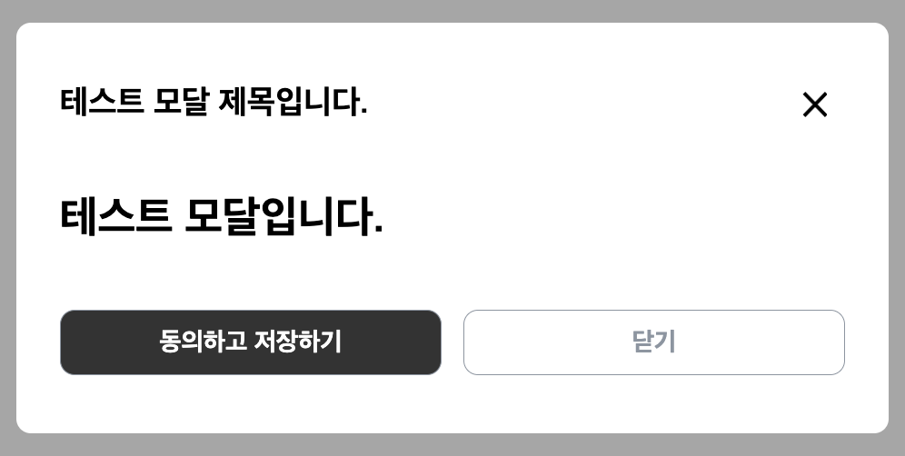
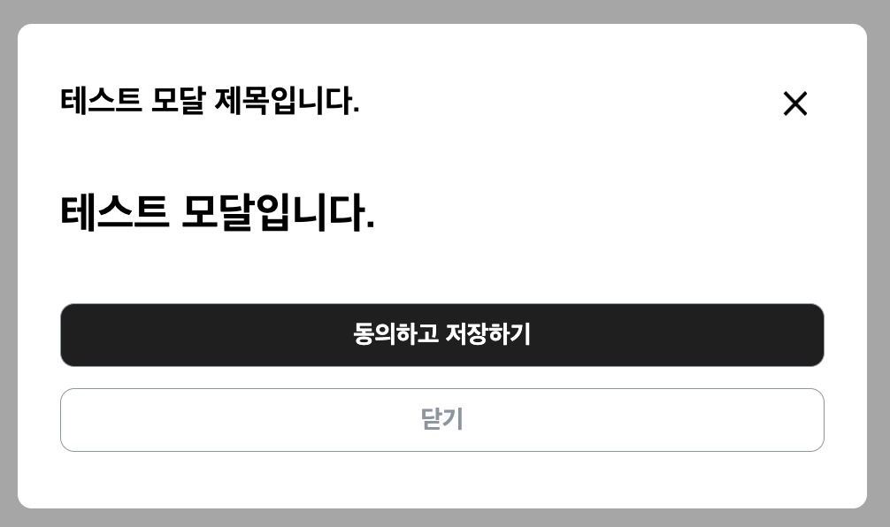
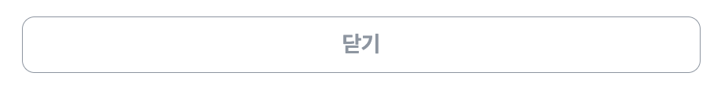
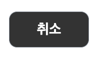
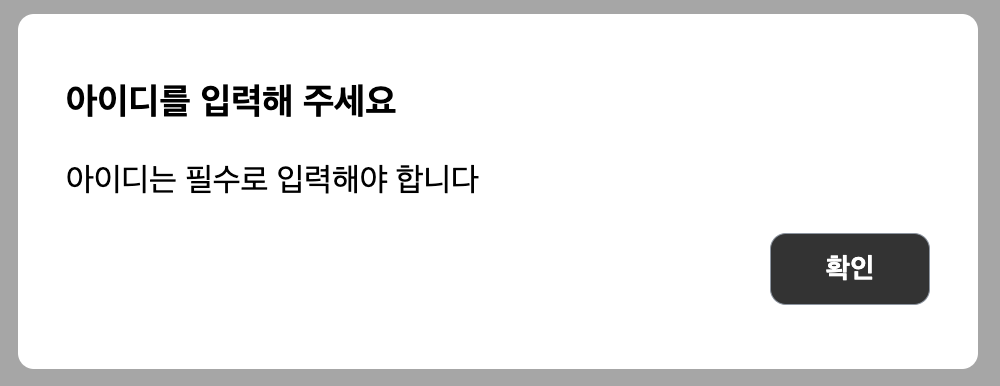
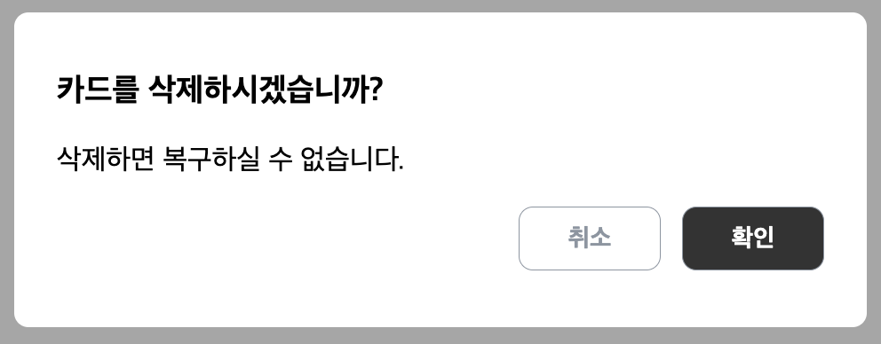
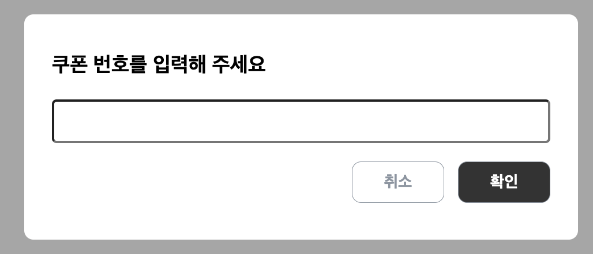
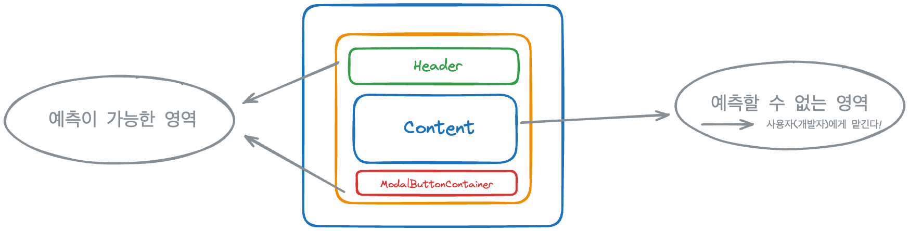

## `harrysimodal` Get Started

### 설치하기

```shell
npm install harrysimodal
```

### 사용예시

```tsx
import React, { useState } from “react”;

import { Modal } from “harrysimodal”;

function App() {
  const [isModalOpen, setIsModalOpen] = useState(false);

  const openModal = () => setIsModalOpen(true);

  const closeModal = () => setIsModalOpen(false);

  return (
    <>
      <button onClick={openModal}>click me, open modal!</button>

      <Modal isOpen={isModalOpen} onClose={closeModal} position="center" device="mobile">
        <Modal.ModalContent size="large">
          <Modal.ModalHeader>
            <Modal.ModalTitle text="your title" />
            <Modal.ModalCloseButton onCloseButtonClick={closeModal} />
          </Modal.ModalHeader>
          <YourContent /> 😊
          <Modal.ModalFooter direction="row" justify="between">
            <Modal.ModalButton theme="dark">button text</Modal.ModalButton>
            <Modal.ModalButton onClick={closeModal}>button text</Modal.ModalButton>
          </Modal.ModalFooter>
        </Modal.ModalContent>
      </Modal>
    </>
  );
}
```

- **Modal**

| Props    | Type              | Default   | Description                                                                                            |
| -------- | ----------------- | --------- | ------------------------------------------------------------------------------------------------------ |
| children | `React.ReactNode` | -         | 모달 내부에 표시할 컨텐츠를 정의합니다.                                                                |
| isOpen   | `boolean`         | -         | 모달의 표시 상태를 결정합니다. `true`일 경우 모달이 렌더링됩니다.                                      |
| position | `ModalPosition`   | 'center'  | 모달의 위치를 정의합니다. 가능한 값은 'top', 'center', 'bottom'입니다.                                 |
| device   | `Device`          | 'desktop' | 디바이스 타입에 따른 모달의 최대 너비를 설정합니다. 가능한 값은 'mobile', 'tablet', 'desktop' 입니다.  |
| onClose  | `() => void`      | -         | 모달을 닫을 때 실행할 핸들러 함수입니다. 일반적으로 백드롭 클릭 시 모달을 닫기 위한 함수를 지정합니다. |

- **Modal.ModalContent**

| Props | Type                       | Default  | Description                                                                   |
| ----- | -------------------------- | -------- | ----------------------------------------------------------------------------- |
| size  | 'small', 'medium', 'large' | 'medium' | 모달 내용의 크기를 결정합니다. 가능한 값은 'small', 'medium', 'large' 입니다. |

- **Modal.Header**

| props              | type       | description                                                                                           |
| ------------------ | ---------- | ----------------------------------------------------------------------------------------------------- |
| text               | string     | 모달의 제목을 표시해줍니다.                                                                           |
| onCloseButtonClick | () => void | 모달 닫기 버튼을 클릭 시, 실행할 핸들러를 받습니다. 위의 예시처럼 모달을 끄는 들러를 넣어주면 됩니다. |

- **Modal.ModalFooter**

| Props     | Type                                                     | Default   | Description                                                                                      |
| --------- | -------------------------------------------------------- | --------- | ------------------------------------------------------------------------------------------------ |
| direction | `'row'`, `'column'`                                      | 'row'     | 모달 푸터에 위치할 수 있는 버튼의 정렬 방향을 결정합니다.                                        |
| justify   | `'center'`, `'start'`, `'end'`, `'stretch'`, `'between'` | 'between' | 버튼의 정렬 위치를 결정합니다. 가능한 값은 'center', 'start', 'end', 'stretch', 'between'입니다. |
| children  | `React.ReactNode`                                        | -         | 모달 푸터 내부에 표시할 컨텐츠를 정의합니다.                                                     |

### ModalFooter 커스텀하기

```tsx
return (
  <>
    <button onClick={openModal}>click me, open modal!</button>
    <Modal isOpen={isOpen} onClose={closeModal}>
      {/* your JSX using harrysimodal library */}
      <Modal.ModalFooter>
        <Modal.ModalButton theme="dark">취소</Modal.ModalButton>
        <Modal.ModalButton onClick={closeModal}>확인</Modal.ModalButton>
      </Modal.ModalFooter>
    </Modal>
  </>
);
```



기본적으로 `direction`은 row, `justify`는 end이기 때문에 위 이미지와 같은 구성으로 UI가 표현됩니다.

```tsx
<Modal.ModalFooter direction="column">
  <Modal.ModalButton theme="dark">취소</Modal.ModalButton>
  <Modal.ModalButton onClick={closeModal}>확인</Modal.ModalButton>
</Modal.ModalFooter>
```



만약, 버튼의 정렬 방향을 변경하고 싶은 경우 props를 다르게 전달해서 UI 구성을 변경할 수 있습니다.

- **Modal.ModalButton**

| Props    | Type               | Default  | Description                                                                  |
| -------- | ------------------ | -------- | ---------------------------------------------------------------------------- |
| children | `React.ReactNode`  | -        | 버튼 내부에 표시할 컨텐츠를 정의합니다.                                      |
| onClick  | `() => void`       | -        | 버튼 클릭 시 호출될 이벤트 핸들러입니다.                                     |
| theme    | `ModalButtonTheme` | 'white'  | 버튼의 테마를 설정합니다. 가능한 값은 'dark', 'white'가 있습니다.            |
| size     | `ModalButtonSize`  | 'medium' | 버튼의 크기를 정의합니다. 가능한 값은 'small', 'medium', 'large'가 있습니다. |
| width    | `ButtonWidthProps` | 'full'   | 버튼의 너비를 설정합니다. 가능한 값은 'full', 'fit', 'fixed'가 있습니다.     |
| disabled | `boolean`          | 'false'  | 버튼의 클릭 여부를 결정할 수 있습니다.                                       |

### ModalButton 커스텀하기



기본적으로 `theme`는 white, `size`는 medium, `width`는 full이기 떄문에 위 이미지와 같은 UI로 표현됩니다.

```tsx
<Modal.ModalButton theme="dark" size="large" width="fixed">
  취소
</Modal.ModalButton>
```



만약, 버튼의 `width`를 줄이거나 색을 변경하고 싶은 경우, props를 다르게 전달해서 UI 구성을 변경할 수 있습니다.

## Use Case

### AlertModal

사용자에게 경고 모달을 보여줄 수 있는 `AlertModal`을 제공합니다.

```tsx
function App() {
  const [isOpen, setIsOpen] = useState(false);

  const openModal = () => setIsOpen(true);

  const closeModal = () => setIsOpen(false);

  return (
    <>
      <button onClick={openModal}>open modal</button>
      <AlertModal isOpen={isOpen} onClose={closeModal} title="아이디를 입력해 주세요" alertText="아이디는 필수로 입력해야 합니다" />
    </>
  );
```



| Props     | Type   | Description                  |
| --------- | ------ | ---------------------------- |
| title     | string | 경고 모달 제목을 표시합니다. |
| alertText | string | 경고 모달 내용을 표시합니다. |

`title`, `alertText`를 전달하면 사용자에게 경고 메시지를 전달할 수 있는 모달을 생성할 수 있습니다.

### ConfirmModal

사용자에게 확인 여부, 선택 여부를 다시 한 번 물을 수 있는 `ConfirmModal`을 제공합니다.

```tsx
function App() {
  const [isOpen, setIsOpen] = useState(false);

  const openModal = () => setIsOpen(true);

  const closeModal = () => setIsOpen(false);

  return (
    <>
      <button onClick={openModal}>open modal</button>
      <ConfirmModal
        isOpen={isOpen}
        onClose={closeModal}
        title="카드를 삭제하시겠습니까?"
        confirmText="삭제하면 복구하실 수 없습니다."
        onConfirm={closeModal}
      />
    </>
  );
}
```



| Props       | Type       | Description                                     |
| ----------- | ---------- | ----------------------------------------------- |
| title       | string     | 확인 모달 제목을 표시합니다.                    |
| confirmText | string     | 확인 모달 내용을 표시합니다.                    |
| onConfirm   | () => void | 확인 버튼을 눌렀을 때 실행할 핸들러 함수입니다. |

`title`, `confirmText`, `onConfirm`를 전달하면 사용자에게 경고 메시지를 전달할 수 있는 모달을 생성할 수 있습니다.

## PromptModal

모달을 사용해서 사용자에게 특정 입력값을 받을 수 있도록 `PromptModal`을 제공합니다.

```tsx
function App() {
  const [isOpen, setIsOpen] = useState(false);
  const [value, setValue] = useState("");

  const openModal = () => setIsOpen(true);

  const closeModal = () => setIsOpen(false);

  return (
    <>
      <button onClick={openModal}>open modal</button>
      <PromptModal
        isOpen={isOpen}
        onClose={closeModal}
        title="쿠폰번호를 입력해 주세요."
        inputValue={value}
        onInputChange={(e) => setValue(e.target.value)}
        onSubmit={closeModal}
      />
    </>
  );
}
```



| Props         | Type                                             | Description                                                     |
| ------------- | ------------------------------------------------ | --------------------------------------------------------------- |
| title         | string                                           | 입력 모달 제목을 표시합니다.                                    |
| inputValue    | string                                           | 입력 모달에서 사용자의 입력을 표시합니다.                       |
| onInputChange | (e: React.ChangeEvent<HTMLInputElement>) => void | 사용자가 입력 모달에 입력을 할 때마다 실행할 핸들러 함수입니다. |
| onSubmit      | () => void                                       | 입력 모달을 제출할 때 실행할 핸들러 함수입니다.                 |

`title`, `inputValue`, `onInputChange`, `onSubmit`를 전달하면 사용자에게 경고 메시지를 전달할 수 있는 모달을 생성할 수 있습니다.
만약 인풋을 여러개 배치하고 싶은 경우, 다음과 같이 `ModalForm`, `ModalInput`을 활용해서 UI 구성을 커스텀할 수도 있습니다.

```tsx
return (
  <Modal isOpen={isOpen} onClose={onClose}>
    <Modal.ModalContent size={size}>
      <Modal.ModalHeader>
        <Modal.ModalTitle text="쿠폰 번호를 입력해 주세요." />
      </Modal.ModalHeader>
      <Modal.ModalForm direction="column">
        <Modal.ModalInput />
        <Modal.ModalInput />
      </Modal.ModalForm>
      <Modal.ModalFooter direction={direction} justify="end">
        <Modal.ModalButton theme="white" size="medium" width="fixed">
          취소
        </Modal.ModalButton>
        <Modal.ModalButton theme="dark" size="medium" width="fixed">
          확인
        </Modal.ModalButton>
      </Modal.ModalFooter>
    </Modal.ModalContent>
  </Modal>
);
```

### 고려한 점

- 예측 가능한 영역과, 그렇지 않은 영역 구분하기



우선 라이브러리의 사용자는 개발자이므로 어떻게 하면 개발자가 유연하게 사용할 수 있을지에 대해서 고민했습니다. 따라서, 예측 가능한 영역과 그렇지 않은 영역을 구분하고 예측이 불가능 한 영역 즉, `Content`와 같은 매번 달라질 수 있는 UI 영역을 `children`으로만 받을 수 있도록 하여 재사용성을 높였습니다.
