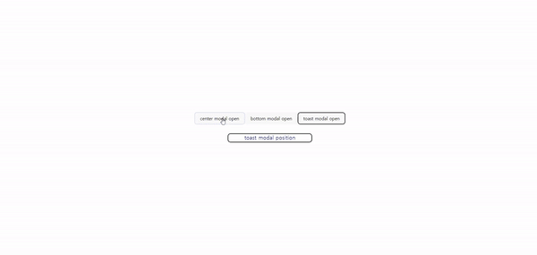

# badahertz52-react-modules-components

**react의 createPortal을 사용한 모달 모듈을 제공하는 라이브러리 입니다.**

### Skill

- react (with Vite)
- typescript
- styled-components



## Install

```
npm i badahertz52-react-modules-components
```

## How to use?

### Modal 사용 전 필수 설정

💡사용하기 전, src/index.html에 아래와 같이 '''modal-root'''라는 DOM Node를 추가해주세요. 🙏

```html
<body>
  <div id="root"></div>
  <div id="modal-root"></div>
</body>
```

### Modal 구조

```tsx
        <ModalPortal>
          <ModalContext.Provider
            value={{
              ..value
            }}
          >
            <ModalWrapper type={type} className={className} {...rest}>
              {type === 'bottom' && <BottomModal children={children} />}
              {type === 'center' && <CenterModal children={children} />}
              {type === 'toast' && <TostModal children={children} />}
            </ModalWrapper>
          </ModalContext.Provider>
        </ModalPortal>

```

### Modal button

모달 내에서 모달 창을 닫는 버튼이 필요하다면, Modal.button을 사용해보세요!

```ts
interface ModalButtonProps extends React.HTMLAttributes<HTMLButtonElement> {
  children: ReactNode;
  isCloseModal: boolean;
  handleCloseModal?: () => void;
}
```

| 구조         | 설명                                                                | props |
| ------------ | ------------------------------------------------------------------- | ----- |
| Modal.button | isCloseModal의 값에 따라 클릭 시 모달창을 닫는 기능을 제공하는 버튼 |

### Modal props

```ts
type ModalType = 'center' | 'bottom' | 'toast';
```

| 키                | 설명                                                                                                                                            | 타입                                   | 필수 | 기본값                               |
| ----------------- | ----------------------------------------------------------------------------------------------------------------------------------------------- | -------------------------------------- | ---- | ------------------------------------ |
| type              | 모달의 형태                                                                                                                                     | `ModalType`                            | Y    | -                                    |
| children          | 모달창 안에 띄울 내용                                                                                                                           | `ReactNode`                            | Y    | -                                    |
| animationDuration | 모달창 열고 닫을 때의 애니메이션 지속 시간(단위:ms)                                                                                             | `number`                               | N    | bottom:500ms, toast:3000ms           |
| isNeedAnimation   | 모달창을 열고 닫을 때 애니메이션 효과를 원하는지 여부                                                                                           | `boolean`                              | N    | type이 bottom이면 true, 아니면 false |
| openModal         | 모달창을 열지 여부                                                                                                                              | `boolean`                              | Y    | -                                    |
| setOpenModal      | openModal의 상태를 변경하는 setState                                                                                                            | `Dispatch<SetStateAction<boolean>>`    | Y    | -                                    |
| isCloseOnEsc      | esc키를 눌렀을때 모달창을 닫을 지 여부 (토스트 모달에서는 해당 기능 없음)                                                                       | `boolean `                             | N    | true                                 |
| isCloseOnBackdrop | 모달의 배경(backdrop)을 클릭했을 때 모달창을 닫을 지 여부 (토스트 모달에서는 해당 기능 없음)                                                    | `boolean`                              | N    | true                                 |
| position          | <ul><li>토스트 모달을 열 위치</li><li> 토스트 모달외의 모달에서는 필요 없음</li><li>⚠️ 토스트 모달에서는 position을 필수로 지정해야함</li></ul> | `ModalPosition`                        | Y    | -                                    |
| toastDuration     | 토스트 모달 지속 시간(단위:ms)                                                                                                                  | `number`                               | Y    | 6000ms                               |
| contentsPadding   | 모달 속 contents의 padding값                                                                                                                    | `string or undefined`                  | N    | `2rem 1.5rem`                        |
| borderRadius      | 모달 속 contents의 border -radius값                                                                                                             | `string`                               | N    | '0.625rem'                           |
| backgroundColor   | 모달 속 contents와 back drop의 배경색                                                                                                           | `{ modal?: string;backdrop?: string;}` | N    | modal:'#ffff', backdrop:'#5959599b'  |

### 제공하는 기능

#### 모달

- Modal : 합성 컴포넌트로 필요한 부분들을 가지고 사용자가 원하는 모달을 만들 수 있습니다.
- BottomModal : type='bottom'시의 모달로, 화면의 하단에 나타납니다. BottomModal의 닫기 기능이 있는 버튼을 사용하고 싶다면, BottomModal.button 을 사용하실 수 있습니다.
- CenterModal : type='center'시의 모달로,화면의 정가운데에 나타납니다.
- TostModal: type='toast'시의 모달로, 지정된 위치에 나타났다가 사용자가 지정한 일정 시간이 지나면 사라집니다.

#### 커스텀 훅

<br/>

**useBottomModalAnimation**

- Bottom Modal 등장,퇴장 시 효과를 주는 훅입니다.
- isNeedAnimation의 값이 true일 경우에만 등장,퇴장 효과가 생성됩니다.
- Bottom Modal에서는 isNeedAnimation의 기본값이 true 입니다.

```tsx
function useBottomModalAnimation({ isNeedAnimation, animationDuration, closeModal }: UseBottomModalAnimationProps): {
  isOn: boolean;
  fadeOutModal: () => void;
  timeout: number;
};
```

<br/>

**useBottomModalContext**

- BottomModalContext로 전해지는 props값을 BottomModal 내에서 사용할 수 있습니다.

```ts
interface BottomModalContextType {
  handleCloseModal: () => void;
}

const BottomModalContext = createContext<BottomModalContextType | null>(null);
```

<br/>

**useModalContext**

- ModalContext로 전해지는 props값을 Modal내에서 사용할 수 있습니다.

```ts
interface ModalContextType {
  isCloseOnEsc?: boolean;
  isCloseOnBackdrop?: boolean;
  animationDuration?: number;
  isNeedAnimation?: boolean;
  position?: ModalPosition;
  closeModal: () => void;
}
const ModalContext = createContext<ModalContextType | null>(null);
```

<br/>

**usePosition**

- Tost Modal에서 모달이 열린 장소를 찾는 데 사용할 수 았는 hook입니다.

  ```ts
  function usePosition(targetElement: HTMLElement | null | undefined): {
    position: ModalPosition;
  };
  ```

  <br/>

**useToastModalAnimation**

- Tost Modal의 등장,퇴장 시 효과를 주는 훅입니다.
- isNeedAnimation의 값이 true일 경우에만 등장,퇴장 효과가 생성됩니다.
- Tost Modal에서는 isNeedAnimation의 기본값이 false 입니다.

```tsx
function useToastModalAnimation(): {
  isOn: boolean;
  position: ModalPosition | undefined;
  timeout: number;
};
```
